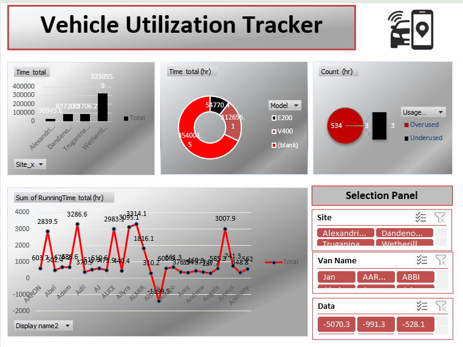

# Vehicle Utilization Dashboard

## Project Overview
- This project analyzes vehicle usage data to monitor utilization patterns and identify overused or underutilized assets.

## Tools Used
- Excel
- Pivot Tables
- Data Analysis

## Dataset Features
- Asset Unique ID
- Asset Type
- Site Location
- Daily Running Hours
- Vehicle Model
- Usage Category

## Key Insights
- Identify overused vehicles
- Track running hours across sites
- Analyze asset utilization patterns

## Dashboard Features
- Vehicle usage summary
- Running time analysis
- Utilization category classification

## Screenshot
- 
